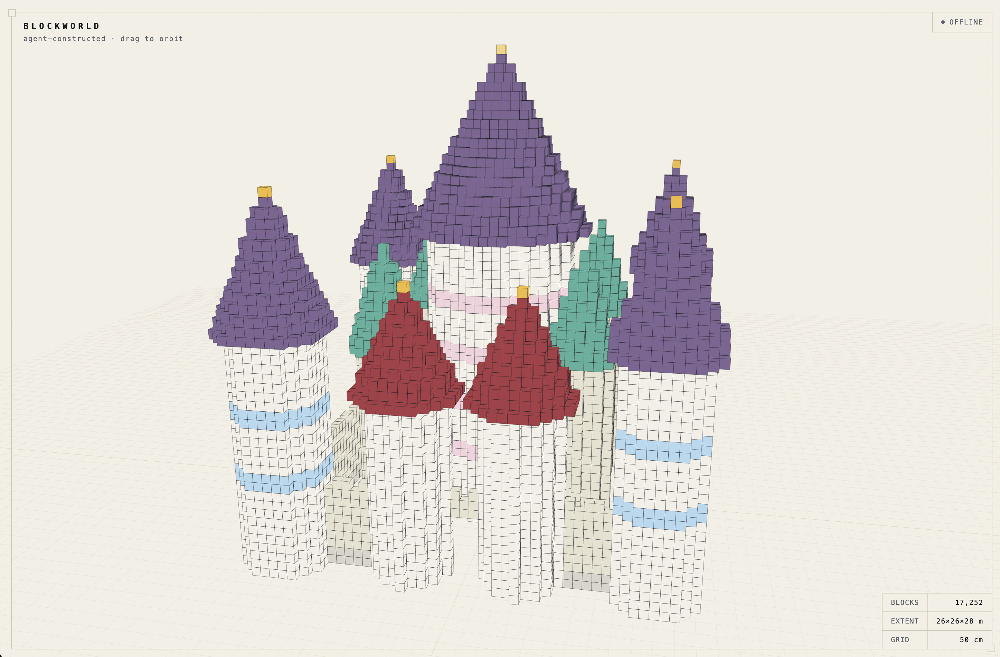

# Blockworld

#### YouTube Video: https://youtu.be/EHHd7kv7y3I

A voxel world for an AI agent to build in.

- **An MCP server** — tools for placing blocks.
- **A viewer** — renders the world as line art, live, block by block as the agent works.
- **Skills** — markdown that teaches an agent what a fairytale castle or a dragon looks like, and how to build one here.

The agent brings the knowledge. The server gives it hands. The skills give it the brief.



---

## Run it

```bash
npm install
npm run viewer        # → http://localhost:5173/viewer/
```

Opens with a mock castle so you can see it working straight away. Add `?live` to suppress it.

Then point an agent at the MCP server:

```json
{
  "mcpServers": {
    "blockworld": {
      "command": "node",
      "args": ["/absolute/path/to/blockworld/server.js"]
    }
  }
}
```

It broadcasts on a WebSocket, so the viewer shows each block as it lands.

```
> build me a castle
> build me a dragon
```

---

## Controls

| | |
|---|---|
| drag / scroll / right-drag | orbit, zoom, pan |
| **F** | reframe |
| **R** | auto-rotate |
| **G** / **E** | grid, edges |
| **1–4** | three-quarter, front, side, plan |

`2` is the silhouette view — the best angle for judging what a build actually reads as.

---

## Tools

| | |
|---|---|
| `world_info` | the grid scale — **call first** |
| `list_materials` | 100 materials |
| `place_box` | walls, floors, rooms |
| `place_cylinder` | towers, columns |
| `place_cone` | spires, caps, horns |
| `place_sphere` | domes, skulls, orbs |
| `place_tube` | curved forms — necks, tails, bodies |
| `mirror` | build one half, mirror it |
| `remove_box` | carve gates, windows |
| `place_block` | detail only |
| `clear` · `describe_world` | reset, inspect |

Everything is cubes. `place_sphere` and `place_tube` don't render spheres or tubes — they rasterize a shape into cubes server-side. The point is tool-call economy: the agent describes a *form* (a path, a radius, a taper) instead of computing five thousand coordinates.

---

## Skills

```
.claude/skills/
  blockworld/   scale, materials, primitives, build order   ← read first
  castle/       fairytale: slender spires, steep caps, gold
  dragon/       S-curve spine, membrane wings, taper
```

Plain markdown, no vendor syntax. Claude Code and Grok both discover `.claude/skills/` automatically. Grok also reads `.grok/skills/`, and some agents use `.agents/skills/` — the path doesn't matter to the content, so rename freely. Any other agent: point it at the files directly.

---

## The one dial

`config.js`:

```js
export const BLOCK_SIZE = 1.0;   // metres per block
```

Everything follows — viewer scale, server readouts, and the agent's own sense of how big to build. It doesn't read the block size from markdown; it calls `world_info`, which derives reference dimensions from the config at runtime:

```
One block is 50 cm.
  castle wall     18 tall
  castle tower    52 tall
  large dragon   100 long
```

The skills are written in **ratios** — *wingspan = 1.5× body length*, *towers 3× the wall* — never metres. So halving `BLOCK_SIZE` gets you a dragon that's still 50m long but made of 8× the cubes. No skill edits.

## Layout

```
config.js            the one dial
palette.js           100 materials, shared
server.js            MCP over stdio + WebSocket :8080
viewer/index.html    Three.js from CDN, no build step
.claude/skills/      blockworld · castle · dragon
```
